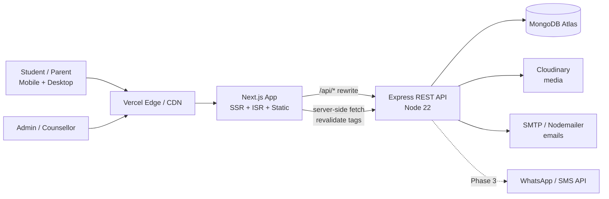
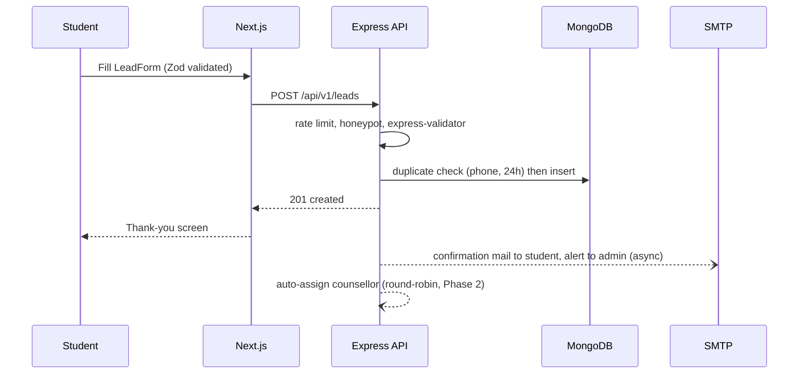

# Technical Requirements & Design Document (TRD): SubhChandra Education

**Version:** 1.0 | **Based on:** SubhChandra_Education_PRD v1.0 | **Owner:** Ashish Kumar, MaaJanki Web Tech
**Stack:** Next.js 16 (App Router) · React 19 · Tailwind CSS 4 · Node.js 22 · Express 5 · MongoDB (Atlas) · Mongoose 9

---

## 1. Purpose and Scope

Yeh document PRD ko implementable technical design me convert karta hai: architecture, folder structure, data design, API contracts, auth, rendering strategy, SEO, security, deployment aur testing. Scope PRD ke Phase 1 (MVP) se Phase 3 tak ka hai; jahan kuch sirf later phase me aayega wahan mark kiya gaya hai.

## 2. High-Level Architecture



**Key design decisions**

| # | Decision | Reason |
|---|---|---|
| D1 | Next.js alag frontend, Express alag API (monorepo) | User ki MERN requirement; admin + public dono ek hi API use karte hain |
| D2 | Next.js `rewrites` se `/api/*` ko Express par proxy karna | Browser ko same-origin dikhta hai, isliye httpOnly cookie auth bina CORS/SameSite problem ke chalta hai |
| D3 | Public content pages ISR (time + on-demand revalidate) | SEO + speed; admin edit karte hi page refresh |
| D4 | Admin panel client-rendered, `noindex` | SEO ki zaroorat nahi, interactivity zyada |
| D5 | REST + JSON, versioned `/api/v1` | Simple, cacheable, team ke liye familiar |
| D6 | Mongoose schemas + Zod/express-validator dono layers par validation | Client UX + server safety |

## 3. Repository Layout (monorepo, already scaffolded)

```
welfare-foundation/            (rename: subhchandra-education/)
├─ package.json                root scripts: dev:server, dev:client
├─ client/                     Next.js app
│  ├─ src/
│  │  ├─ app/
│  │  │  ├─ (site)/            public routes
│  │  │  │  ├─ page.js                      Home
│  │  │  │  ├─ programs/[slug]/page.js
│  │  │  │  ├─ financial-aid/...
│  │  │  │  ├─ locations/[city]/page.js
│  │  │  │  ├─ blog/[slug]/page.js
│  │  │  │  └─ counselling, faq, contact, gallery, about
│  │  │  ├─ admin/             protected dashboard (layout with auth guard)
│  │  │  ├─ sitemap.js, robots.js
│  │  │  └─ layout.js          fonts, theme, JSON-LD Organization
│  │  ├─ components/           ui/, sections/, forms/, admin/
│  │  ├─ lib/                  api.js, seo.js, validators.js, constants.js
│  │  └─ styles/globals.css    Tailwind v4 @theme tokens
│  └─ next.config.mjs
└─ server/
   └─ src/
      ├─ index.js              bootstrap (DB connect, listen)
      ├─ app.js                express app (middleware + routes) - testable
      ├─ config/               env.js, db.js, cloudinary.js, mailer.js
      ├─ models/               *.model.js
      ├─ routes/               public.routes.js, admin.routes.js, auth.routes.js
      ├─ controllers/          thin; call services
      ├─ services/             business logic (lead.service, revalidate.service ...)
      ├─ middleware/           auth, rbac, validate, rateLimit, error, upload
      ├─ validators/           express-validator chains
      ├─ utils/                ApiError, slug, pagination, csv
      └─ seeds/                admin user, programs, FAQs, cities
```

Current repo me `app.js` alag nahi hai (sirf `index.js`); build ke time ise `app.js` + `index.js` me split karna hai taaki Supertest se test ho sake.

## 4. Frontend Technical Design

### 4.1 Rendering strategy

| Route | Strategy | Revalidate |
|---|---|---|
| `/`, `/programs`, `/programs/[slug]`, `/locations/[city]`, `/blog/[slug]`, `/financial-aid/*`, `/faq`, `/gallery` | ISR (static + `revalidate` tag) | 1 hr + on-demand via webhook from admin save |
| `/counselling`, `/contact` | Static shell + client form | n/a |
| `/admin/*` | Client components, auth-guarded layout, `noindex` | n/a |
| `generateStaticParams` | Pre-build top programs, cities, posts | n/a |

Next 15/16 me `params` async hota hai, isliye `const { slug } = await params;` use karna hai.

### 4.2 Data fetching

- Public pages: server component me `fetch(`${API}/programs/${slug}`, { next: { tags: ['program:'+slug], revalidate: 3600 } })`.
- Admin pages: SWR + axios (`withCredentials`), optimistic updates for status change.
- Forms: React Hook Form + Zod resolver, `react-hot-toast` for feedback.
- Central `lib/api.js` error normalisation (`{ message, fieldErrors }`).

### 4.3 Design system (Tailwind 4 tokens, PRD palette)

```css
@import "tailwindcss";
@theme {
  --color-primary-50:  #E6F4F1;   /* soft mint */
  --color-primary-500: #1B7F88;
  --color-primary-700: #0F5C63;   /* deep teal */
  --color-primary-900: #0A3F44;
  --color-accent-400:  #FBBF24;
  --color-accent-500:  #F59E0B;   /* saffron amber */
  --color-ink:         #12262A;
  --color-surface:     #FAFCFC;
  --color-success:     #16A34A;
  --color-danger:      #DC2626;
  --font-heading: "Poppins", system-ui, sans-serif;
  --font-body:    "Inter", system-ui, sans-serif;
  --radius-card:  12px;
}
```

- Fonts via `next/font/google` (Poppins, Inter, Noto Sans Devanagari with `display: swap`).
- Accessibility: primary-700 on white ≈ 8:1 contrast; accent-500 par text white nahi, `ink` use karna (white on amber contrast kam hai).
- Breakpoints mobile-first (`sm 640, md 768, lg 1024, xl 1280`).

### 4.4 Core components

`Header` (sticky, mega-menu for programs) · `Hero` · `ProgramCard` · `ProgramFilters` · `StatStrip` · `HowItWorks` · `AidBanner` · `CityCard` · `TestimonialCarousel` · `GalleryGrid + Lightbox` · `FaqAccordion` (+ FAQ JSON-LD) · `LeadForm` (variants: full, compact, program-inline) · `StickyCallbackBar` · `WhatsAppFab` · `Footer` · Admin: `DataTable`, `RichTextEditor`, `ImageUploader`, `StatusSelect`, `StatCard`.

### 4.5 SEO implementation

- `generateMetadata` har dynamic page par (title, description, canonical, OG, Twitter).
- JSON-LD: `Organization` (layout), `Course` (program), `FAQPage`, `BreadcrumbList`, `Article` (blog), `LocalBusiness` (city page).
- `app/sitemap.js` API se slugs fetch karke generate; `robots.js` admin ko disallow.
- Hindi toggle (Phase 2): `/hi/...` locale segments with `hreflang`.

### 4.6 Performance budget

LCP < 2.5s (4G mobile), CLS < 0.1, INP < 200ms. `next/image` with Cloudinary loader, JS per route < 150 KB gz, framer-motion sirf above-fold-light animations me, below-fold sections `dynamic()` import.

## 5. Backend Technical Design

### 5.1 Layering

`route → validator → controller → service → model`. Controllers me business logic nahi; services reusable (lead creation, email, revalidate ping).

### 5.2 Middleware order (`app.js`)

```
helmet → cors(allowlist, credentials) → express.json({limit:'1mb'}) → cookieParser
→ mongoSanitize-style key stripping → morgan → /api/v1 routes → notFound → errorHandler
```

Express 5 me rejected promises automatically error handler tak jate hain, isliye `asyncHandler` wrapper ki zaroorat nahi.

### 5.3 Standard response format

```json
// success
{ "success": true, "data": {...}, "meta": { "page": 1, "limit": 12, "total": 87 } }
// error
{ "success": false, "message": "Validation failed", "errors": [{ "field": "phone", "message": "Invalid mobile" }] }
```

### 5.4 Rate limits

| Endpoint | Limit |
|---|---|
| `POST /leads` | 5 / 10 min / IP |
| `POST /auth/login` | 10 / 15 min / IP (+ account lockout after 5 fails) |
| Public GET | 300 / 15 min / IP |

## 6. Database Design (MongoDB)

### 6.1 Collections and indexes

| Collection | Key fields | Indexes |
|---|---|---|
| users | name, email, passwordHash, role, isActive | `email` unique |
| programs | title, slug, level, stream, mode[], duration, eligibility, overview, syllabus[], careers[], feeRange{min,max,note}, institutions[ref], faqs[], seo, isFeatured, isPublished, lastReviewedAt | `slug` unique; `{level,stream,isPublished}`; text index on `title, overview` |
| institutions | name, slug, logo, location, about, programs[ref], isPublished | `slug` unique |
| cities | name, slug, state, address, geo, mapUrl, phone, intro, isPublished | `slug` unique |
| leads | name, phone, email, city, qualification, program[ref], mode, preferredSlot, message, source{page,utm}, status, assignedTo[ref], notes[], consent{given,at,ip}, createdAt | `{status,createdAt}`; `{assignedTo,status}`; `{phone,createdAt}` (duplicate detection) |
| posts | title, slug, content, category, tags[], author[ref], coverImage, seo, status, publishedAt | `slug` unique; `{status,publishedAt}` |
| faqs, gallery, testimonials, settings | as per PRD | `{topic,order}`, `{category,order}`, `key` unique |

### 6.2 Sample schema: Lead

```js
const leadSchema = new Schema({
  name:  { type: String, required: true, trim: true, maxlength: 80 },
  phone: { type: String, required: true, match: /^[6-9]\d{9}$/ },
  email: { type: String, lowercase: true, trim: true },
  city:  { type: String, trim: true },
  qualification: { type: String, enum: ['10th','12th','Graduate','Postgraduate','Working'] },
  program: { type: Schema.Types.ObjectId, ref: 'Program' },
  mode: { type: String, enum: ['telephonic','office','video'], required: true },
  preferredSlot: { date: Date, window: { type: String, enum: ['morning','afternoon','evening'] } },
  message: { type: String, maxlength: 1000 },
  source: { page: String, utm: { source: String, medium: String, campaign: String } },
  status: { type: String, enum: ['new','contacted','counselled','converted','closed'], default: 'new' },
  assignedTo: { type: Schema.Types.ObjectId, ref: 'User' },
  notes: [{ by: { type: Schema.Types.ObjectId, ref: 'User' }, text: String, at: { type: Date, default: Date.now } }],
  consent: { given: { type: Boolean, required: true }, at: Date, ip: String },
}, { timestamps: true });
leadSchema.index({ status: 1, createdAt: -1 });
```

### 6.3 Data rules

- Slugs `slugify` se auto-generate, unique suffix on collision.
- Soft publish via `isPublished`; deletes admin ke liye hard delete sirf Super Admin.
- Lead PII retention: closed leads 24 mahine baad anonymise (scheduled job, Phase 3).
- Seeds: 1 super admin, 17 launch programs, default FAQs, 3 cities (Meerut, Moradabad, Aligarh), settings keys.

## 7. API Specification (`/api/v1`)

### 7.1 Public

| Method | Path | Notes |
|---|---|---|
| GET | `/programs` | query: `q, level, stream, mode, duration, page, limit, sort` |
| GET | `/programs/:slug` | populated institutions |
| GET | `/institutions`, `/institutions/:slug` | |
| GET | `/cities`, `/cities/:slug` | |
| GET | `/posts`, `/posts/:slug` | `category, tag, page` |
| GET | `/faqs?topic=` | |
| GET | `/gallery?category=` | |
| GET | `/testimonials` | |
| GET | `/settings/public` | stats, phone, social links |
| POST | `/leads` | body below; returns `201 { data: { id } }` |

```json
POST /api/v1/leads
{ "name":"Rahul Kumar","phone":"9XXXXXXXXX","email":"rahul@example.com","city":"Patna",
  "qualification":"12th","program":"<programId>","mode":"telephonic",
  "preferredSlot":{"date":"2026-10-10","window":"evening"},"message":"...",
  "consent":true,"source":{"page":"/programs/bca","utm":{"source":"google"}},"website":"" }
```
`website` honeypot field: agar bhara hai to silently `201` return, lead save nahi.

### 7.2 Auth

| Method | Path | Behaviour |
|---|---|---|
| POST | `/auth/login` | sets `access` (15 min) + `refresh` (7 day) httpOnly, Secure, SameSite=Lax cookies |
| POST | `/auth/refresh` | rotates refresh token |
| POST | `/auth/logout` | clears cookies |
| GET | `/auth/me` | current user + role |

### 7.3 Admin (auth + RBAC)

| Resource | Super Admin | Editor | Counsellor |
|---|---|---|---|
| programs / institutions / cities / posts / faqs / gallery / testimonials | CRUD | CRUD (no delete) | read |
| leads | all + export + delete | read | assigned + update status/notes |
| settings, users | CRUD | none | none |
| stats | yes | yes | own |

Extra endpoints: `PATCH /admin/leads/:id` (status, assignedTo, add note), `GET /admin/leads/export?from&to&status` (CSV stream), `GET /admin/stats?range=30d`, `POST /admin/upload` (multer memory → Cloudinary, 5 MB, jpg/png/webp only).

## 8. Key Flows

### 8.1 Counselling lead submission



### 8.2 Content publish and cache refresh

Admin saves program → API updates DB → API calls `POST {CLIENT_URL}/api/revalidate` with secret and tags (`program:bca`, `programs`) → Next ISR cache refresh → next visitor ko fresh page.

### 8.3 Admin auth guard

`admin/layout.js` client-side `GET /auth/me`; 401 par refresh try, fail par `/admin/login`. Server har admin route par `requireAuth` + `requireRole`.

## 9. Security Requirements

- Passwords bcrypt (cost 12); strong password policy for admin.
- JWT secrets env me; access/refresh alag secrets; refresh token hash DB me store (rotation + reuse detection).
- CSRF: SameSite=Lax + mutating routes par custom header check (`X-Requested-With`) + same-origin proxy.
- Input: validator + `$`/`.` key stripping against NoSQL injection; HTML content (blog) server par sanitize (`sanitize-html`) before save.
- Upload: MIME + extension whitelist, size cap, Cloudinary folder separation.
- Helmet CSP (Next inline script nonce), HSTS, `Referrer-Policy`.
- Secrets kabhi repo me nahi; `.env.example` hi commit.
- Audit log (Phase 2): admin create/update/delete events collection.
- DPDP: consent stored with timestamp + IP, delete/export-on-request process documented.

## 10. Environment Variables

**server:** `PORT, NODE_ENV, MONGODB_URI, JWT_ACCESS_SECRET, JWT_REFRESH_SECRET, CLIENT_URL, REVALIDATE_SECRET, CLOUDINARY_*, SMTP_HOST/PORT/USER/PASS, ADMIN_NOTIFY_EMAIL`
**client:** `NEXT_PUBLIC_SITE_URL, API_INTERNAL_URL, REVALIDATE_SECRET, NEXT_PUBLIC_GA_ID, NEXT_PUBLIC_WHATSAPP_NUMBER`

## 11. Deployment and DevOps

| Layer | Host | Notes |
|---|---|---|
| Client | Vercel | Preview deploy per PR |
| API | Render / Railway / VPS (PM2 + Nginx) | Node 22, health check `/api/health` |
| DB | MongoDB Atlas (M10 production, M0 dev) | IP allowlist, daily snapshots, point-in-time restore |
| Media | Cloudinary | auto-format/quality |

- **CI (GitHub Actions):** install → lint → test → build for both apps on each PR.
- **CD:** main branch → production; staging branch → staging env.
- **Observability:** Sentry (client + server), uptime monitor on `/api/health`, structured logs (pino in Phase 2), Vercel Analytics + GA4.

## 12. Testing Strategy

| Level | Tool | Coverage target |
|---|---|---|
| Unit (services, utils, validators) | Vitest/Jest | 80% |
| API integration | Jest + Supertest + mongodb-memory-server | all routes, auth/RBAC matrix |
| Component | React Testing Library | forms, filters, accordion |
| E2E | Playwright | lead submit, program filter, admin login + lead update |
| Non-functional | Lighthouse CI, axe-core | mobile score 90+, zero critical a11y issues |

## 13. Requirement Traceability (PRD → TRD)

| PRD item | TRD section |
|---|---|
| Programs listing/detail | 4.1, 6.1, 7.1 |
| Counselling booking | 6.2, 7.1, 8.1 |
| Financial aid pages | 4.1 (ISR), 6.3 (lastReviewedAt) |
| City pages | 4.1, 6.1 `cities` |
| Admin lead management | 7.3, 8.3 |
| SEO goals | 4.5 |
| Performance goals | 4.6 |
| Security and DPDP | 9 |

## 14. Implementation Milestones

| Sprint | Deliverable |
|---|---|
| S0 (1 wk) | Rename repo, split `app.js`, env/config, Tailwind tokens, fonts, CI |
| S1 | Models + seeds, public GET APIs, auth + RBAC |
| S2 | Home, programs list/detail, lead form + `POST /leads`, emails |
| S3 | Admin: programs CRUD, leads table + status flow, CSV export |
| S4 | FAQ, contact, SEO (metadata, JSON-LD, sitemap), revalidate hook, QA, launch MVP |
| S5-S6 | Financial aid, cities, blog, gallery, testimonials, Hindi |
| S7-S8 | Stats dashboard, WhatsApp/SMS, institutions, retention job, A/B tests |

## 15. Risks and Technical Open Points

| Risk / Question | Plan |
|---|---|
| Cross-domain cookie issues | D2 proxy rewrite; fallback: same parent domain (`api.subhchandra...`) |
| ISR stale content after edit | On-demand revalidate + 1 hr fallback |
| Lead spam | Honeypot + rate limit + CAPTCHA toggle (Turnstile) |
| SMTP deliverability | SPF/DKIM/DMARC setup, or move to SES/Resend |
| Free-tier cold starts on API host | Use paid always-on instance for production |
| Open: OTP provider (MSG91 / Twilio)? | Decide before S2 |
| Open: WhatsApp Business API vendor? | Decide before S7 |
